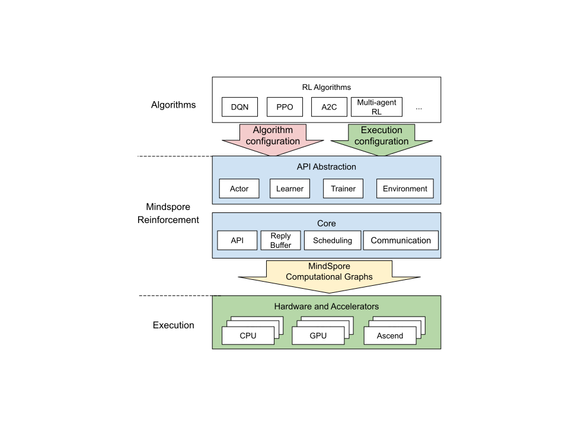

# MindSpore Reinforcement

[查看中文](./README_CN.md)

<!-- TOC -->

- MindSpore Reinforcement
    - [Overview](#overview)
    - Installation
        - [Installing from pip command](#installing-from-pip-command)
        - [Installing from source code](#installing-from-source-code)
    - [Quick Start](#quick-start)
    - Documents
        - [Developer Guide](#developer-guide)
    - Community
        - [Governance](#governance)
        - [Communication](#communication)
    - [Contributions](#contributions)
    - [License](#license)

<!-- /TOC -->

## Overview

MindSpore Reinforcement is an open-source reinforcement learning framework that supports the distributed training of agents using reinforcement learning algorithms. MindSpore Reinforcement offers a clean API abstraction for writing reinforcement learning algorithms, which decouples the algorithm from deployment and execution considerations, including the use of accelerators, the level of parallelism and the distribution of computation across a cluster of workers. MindSpore Reinforcement translates the reinforcement learning algorithm into a series of compiled computational graphs, which are then run efficiently by the MindSpore framework on CPUs, GPUs and Ascend AI processors. Its architecture is shown below:



### Future Roadmap

This initial release of MindSpore Reinforcement contains a stable API for implementing reinforcement learning algorithms and executing computation using MindSpore's computational graphs. It does not yet include the more advanced features for the parallel and distributed execution of algorithms or the support for multi-agent scenarios with cooperating and competing agents - stay tuned for future releases of MindSpore Reinforcement that will include these features.

## Installation

MindSpore Reinforcement depends on the MindSpore training and inference framework. Therefore, please first install [MindSpore](https://www.mindspore.cn/install/en) following the instruction on the official website, then install MindSpore Reinforcement. You can install from `pip` or source code.

### Installing from pip command

If you use the pip command, please download the whl package from [MindSpore Reinforcement](https://www.mindspore.cn/versions/en) page and install it.

```shell
pip install  https://ms-release.obs.cn-north-4.myhuaweicloud.com/{MindSpore_version}/Reinforcement/any/mindspore_rl-{Reinforcement_version}-py3-none-any.whl --trusted-host ms-release.obs.cn-north-4.myhuaweicloud.com -i https://pypi.tuna.tsinghua.edu.cn/simple
```

> - Installing whl package will download MindSpore Reinforcement dependencies automatically (detail of dependencies is shown in requirement.txt),  other dependencies should install manually.
> - `{MindSpore_version}` stands for the version of MindSpore. For the version matching relationship between MindSpore and Reinforcement, please refer to [page](https://www.mindspore.cn/versions).
> - `{Reinforcement_version}` stands for the version of Reinforcement. For example, if you would like to download version 0.1.0, you should fill 1.5.0 in `{MindSpore_version}` and fill 0.1.0 in `{Reinforcement_version}`.

### Installing from source code

Download [source code](https://gitee.com/mindspore/reinforcement), then enter the `reinforcement` directory.

```shell
bash build.sh
pip install output/mindspore_rl-{Reinforcement_version}-py3-none-any.whl
```

`build.sh` is the compiling script in `reinforcement` directory.

### Verification

If you can successfully execute following command, then the installation is completed.

```python
import mindspore_rl
```

## Quick Start

[Deep Q-Learning (DQN)](https://www.mindspore.cn/reinforcement/docs/en/master/dqn.html) is used to demonstrate how to use MindSpore Reinforcement.

## Documents

### Developer Guide

For more details about the installation guide, tutorials, and APIs, see [MindSpore Reinforcement API Docs](https://www.mindspore.cn/reinforcement/docs/en/master/index.html).

## Community

### Governance

[MindSpore Open Governance](https://gitee.com/mindspore/community/blob/master/governance.md)

### Communication

- [MindSpore Slack](https://join.slack.com/t/mindspore/shared_invite/zt-dgk65rli-3ex4xvS4wHX7UDmsQmfu8w) developer communication platform

## Contributions

Welcome to MindSpore contribution.

## License

[Apache License 2.0](https://gitee.com/mindspore/reinforcement/blob/master/LICENSE)

