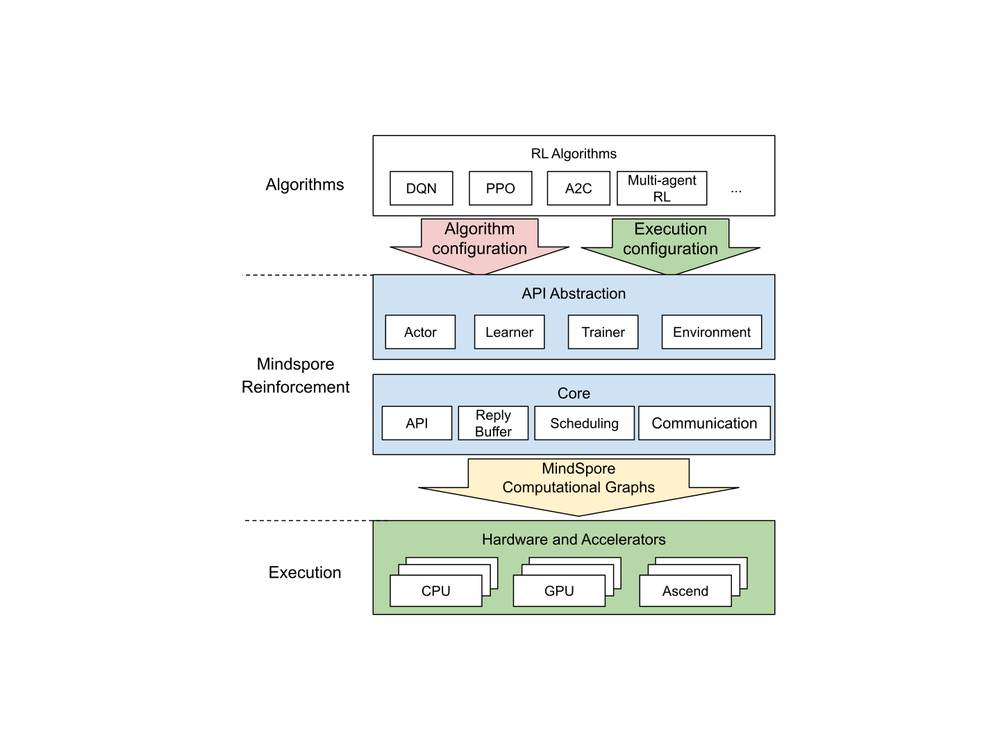

# MindSpore Reinforcement

[View English](./README.md)

<!-- TOC -->

- MindSpore Reinforcement
    - [概述](#概述)
    - 安装
        - [pip安装](#pip安装)
        - [源码编译安装](#源码编译安装)
    - [快速入门](#快速入门)
    - 文档
        - [开发者教程](#开发者教程)
    - 社区
        - [治理](#治理)
        - [交流](#交流)
    - [贡献](#贡献)
    - [许可证](#许可证)

<!-- /TOC -->

## 概述

MindSpore Reinforcement是一个开源的强化学习框架，支持使用强化学习算法对agent进行分布式训练。MindSpore Reinforcement为编写强化学习算法提供了干净整洁的API抽象，它将算法与部署和执行注意事项解耦，包括加速器的使用、并行度和跨worker集群计算的分布。MindSpore Reinforcement将强化学习算法转换为一系列编译后的计算图，然后由MindSpore框架在CPU、GPU或Ascend AI处理器上高效运行。MindSpore Reinforcement的架构在如下展示:



### 未来路标

MindSpore Reinforcement初始版本包含了一个稳定的API， 用于实现强化学习算法和使用MindSpore的计算图执行计算。它暂时不包含算法并行和分布式执行的高级功能，也不支持合作和竞争agent的多agent场景。MindSpore Reinforcement的后续版本将包含这些功能，敬请期待。

## 安装

MindSpore Reinforcement依赖MindSpore训练推理框架，安装完[MindSpore](https://gitee.com/mindspore/mindspore#%E5%AE%89%E8%A3%85)，再安装MindSpore Reinforcement。可以采用pip安装或者源码编译安装两种方式。

### MindSpore版本依赖关系

由于MindSpore Reinforcement与MindSpore有依赖关系，请按照根据下表中所指示的对应关系，在[MindSpore下载页面](https://www.mindspore.cn/versions)下载并安装对应的whl包。

```shell
pip install https://ms-release.obs.cn-north-4.myhuaweicloud.com/{MindSpore-Version}/MindSpore/cpu/ubuntu_x86/mindspore-{MindSpore-Version}-cp37-cp37m-linux_x86_64.whl
```

| MindSpore Reinforcement |                             分支                             | MindSpore |
| :---------------------: | :----------------------------------------------------------: | :-------: |
|          0.5.0          | [r0.5](https://gitee.com/mindspore/reinforcement/tree/r0.5/) |   1.8.0   |
|          0.3.0          | [r0.3](https://gitee.com/mindspore/reinforcement/tree/r0.3/) |   1.7.0   |
|          0.2.0          | [r0.2](https://gitee.com/mindspore/reinforcement/tree/r0.2/) |   1.6.0   |
|          0.1.0          | [r0.1](https://gitee.com/mindspore/reinforcement/tree/r0.1/) |   1.5.0   |

### pip安装

使用pip命令安装，请从[MindSpore-RL下载页面](https://www.mindspore.cn/versions)下载并安装whl包。

```shell
pip install https://ms-release.obs.cn-north-4.myhuaweicloud.com/{MindSpore_version}/Reinforcement/any/mindspore_rl-{Reinforcement_version}-py3-none-any.whl --trusted-host ms-release.obs.cn-north-4.myhuaweicloud.com -i https://pypi.tuna.tsinghua.edu.cn/simple
```

> - 在联网状态下，安装whl包时会自动下载MindSpore Reinforcement安装包的依赖项（依赖项详情参见requirement.txt），其余情况需自行安装。
> - `{MindSpore_version}`表示MindSpore版本号，MindSpore和Reinforcement版本配套关系参见[页面](https://www.mindspore.cn/versions)。
> - `{Reinforcement_version}`表示Reinforcement版本号。例如下载0.1.0版本Reinforcement时，`{MindSpore_version}应写为1.5.0，{Reinforcement_version}`应写为0.1.0。

### 源码编译安装

下载[源码](https://gitee.com/mindspore/reinforcement)，下载后进入`reinforcement`目录。

```shell
bash build.sh
pip install output/mindspore_rl-{Reinforcement_version}-py3-none-any.whl
```

其中，`build.sh`为`reinforcement`目录下的编译脚本文件。`{version}`表示MindSpore Reinforcement版本号。

### 验证是否成功安装

执行以下命令，验证安装结果。导入Python模块不报错即安装成功：

```python
import mindspore_rl
```

## 快速入门

以一个简单的算法[Deep Q-Learning (DQN)](https://www.mindspore.cn/reinforcement/docs/zh-CN/master/dqn.html) 示例，演示MindSpore Reinforcement如何使用。

## 文档

### 开发者教程

有关安装指南、教程和API的更多详细信息，请参阅[用户文档](https://www.mindspore.cn/reinforcement/docs/zh-CN/master/index.html)。

## 社区

### 治理

查看MindSpore如何进行[开放治理](https://gitee.com/mindspore/community/blob/master/governance.md)。

### 交流

- [MindSpore Slack](https://join.slack.com/t/mindspore/shared_invite/zt-dgk65rli-3ex4xvS4wHX7UDmsQmfu8w) 开发者交流平台。

## 贡献

欢迎参与贡献。

## 许可证

[Apache License 2.0](https://gitee.com/mindspore/reinforcement/blob/master/LICENSE)
