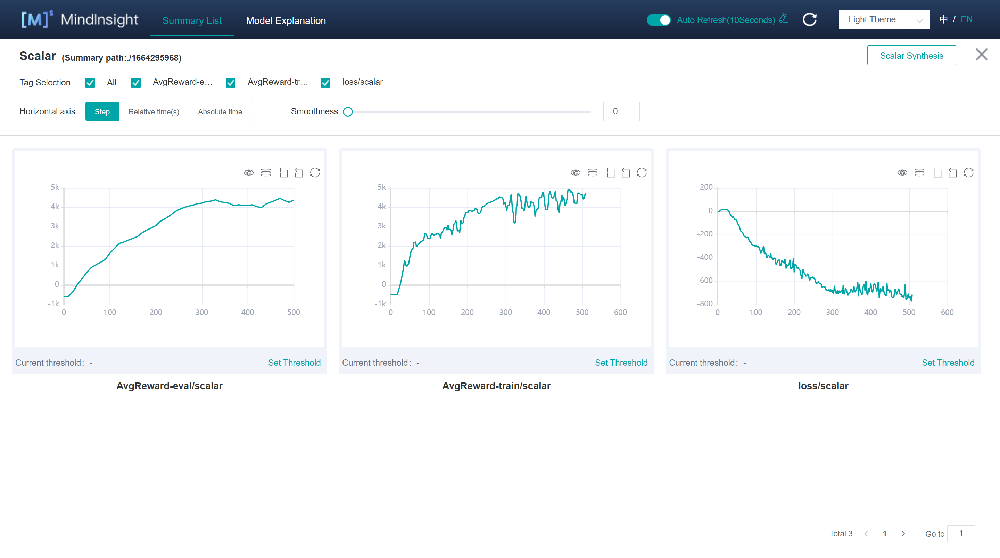

# Twin Delayed Deep Deterministic Policy Gradient (TD3)

## Related Paper

1. Scott Fujimoto, Herke van Hoof, et al. ["Addressing Function Approximation Error in Actor-Critic Methods"](https://arxiv.org/pdf/1802.09477.pdf)
2. David Silver, Guy Lever, et al. ["Deterministic Policy Gradient Algorithms"](https://proceedings.mlr.press/v32/silver14.pdf)

## Game that this algorithm used

Same as DDPG algorithm, TD3 algorithm applies an open source reinforcement learning library named [Gym](https://github.com/openai/gym). Developed by OpenAI company, Gym provides various games for training different reinforcement algorithms.

TD3 has solved the game called [HalfCheetah-v2](https://www.gymlibrary.ml/environments/mujoco/half_cheetah/) in OpenAI Gym. If you would like to run this game, implement and train TD3 algorithm, it is necessary to install an additional library named [MuJoCo](https://github.com/openai/mujoco-py). The interface of this game is shown below (image from https://www.gymlibrary.dev/environments/mujoco/half_cheetah/):


## How to run TD3

Before running TD3, you should first install [MindSpore](https://www.mindspore.cn/install/en)(>=1.7.0) and [MindSpore-Reinforcement](https://www.mindspore.cn/reinforcement/docs/en/r0.5/reinforcement_install.html). Besides, the following dependencies should be installed. Please follow the installation instructions on their official websites.

- [MindInsight](https://mindspore.cn/mindinsight/docs/en/r1.8/mindinsight_install.html) (whose version should be same as installed MindSpore in your device. Installation via pip is recommended.)
- numpy >= 1.22.0
- [gym](https://github.com/openai/gym) >= 0.21.3
- [mujoco-py](https://github.com/openai/mujoco-py)<2.2,>=2.1

It has been practical to monitor the training process of TD3 on [MindInsight](https://mindspore.cn/mindinsight/docs/en/r1.8/index.html)dashboard, which is convenient for users to witness the real-time results returned from training process.

### Train

```shell
> cd example/td3/scripts
> bash run_standalone_train.sh [EPISODE](Optional) [DEVICE_TARGET](Optional)
```

#### Parameters Illustration

- `EPISODE`：total training episode of TD3 and equals to the sum of running games. Default is `2000`.
- `DEVICE_TARGET`：target device for training and chosen one among `Auto`,`CPU` and `GPU`. Default is `GPU`.

You will obtain outputs which is similar to the following lines in `td3_train_log.txt`.

```shell
Episode 0 has 1000.0 steps, cost time: 26480.130 ms, per step time: 26.480 ms
Episode 0: loss is -2.387, rewards is -465.396
Episode 1 has 1000.0 steps, cost time: 5216.369 ms, per step time: 5.216 ms
Episode 1: loss is 2.088, rewards is -536.777
Episode 2 has 1000.0 steps, cost time: 4607.308 ms, per step time: 4.607 ms
Episode 2: loss is 1.311, rewards is -509.436
Episode 3 has 1000.0 steps, cost time: 4895.000 ms, per step time: 4.895 ms
Episode 3: loss is -2.143, rewards is -484.398
Episode 4 has 1000.0 steps, cost time: 5132.120 ms, per step time: 5.132 ms
Episode 4: loss is -0.563, rewards is -504.957
Episode 5 has 1000.0 steps, cost time: 5128.416 ms, per step time: 5.128 ms
Episode 5: loss is 0.886, rewards is -535.614
Episode 6 has 1000.0 steps, cost time: 5028.265 ms, per step time: 5.028 ms
Episode 6: loss is 1.338, rewards is -558.457
Episode 7 has 1000.0 steps, cost time: 4774.283 ms, per step time: 4.774 ms
Episode 7: loss is -0.599, rewards is -465.199
Episode 8 has 1000.0 steps, cost time: 4625.283 ms, per step time: 4.625 ms
Episode 8: loss is 7.29, rewards is -318.291
Episode 9 has 1000.0 steps, cost time: 4840.158 ms, per step time: 4.840 ms
Episode 9: loss is 6.913, rewards is -511.637
Episode 10 has 1000.0 steps, cost time: 6550.410 ms, per step time: 6.550 ms
Episode 10: loss is 13.045, rewards is -517.86
-----------------------------------------
Evaluate for episode 10 total rewards is -567.105
```

#### Start MindInsight Dashboard

```python
> mindinsight start --summary-base-dir ./summary
```

MindInsight has been integrated into this algorithm. Records in training process will be store in the folder name `summary` where training script runs whether MindInsight starts or not.

If you had installed MindInsight, it can be opened as long as you visit `http://127.0.0.1:8080` in your browser most of the time. Click on "Training Dashboard" and enter target directory, you will find the visualised output data just like the image below.



### Evaluation

```shell
> cd example/ddpg/scripts
> bash run_standalone_eval.sh [CKPT_FILE_PATH] [DEVICE_TARGET](optional)
```

You will obtain outputs which is similar with the things below in `td3_eval_log.txt`.

```shell
Load file /path/ckpt/actor_net/actor_net_950.ckpt
-----------------------------------------
Evaluate result is 6000.300, checkpoint file in /path/ckpt/actor_net/actor_net_950.ckpt
-----------------------------------------
```

## Supported Platform

TD3 algorithm supports GPU and CPU platform and achieves better performance in GPU environment.
